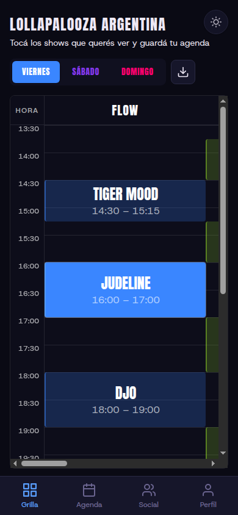
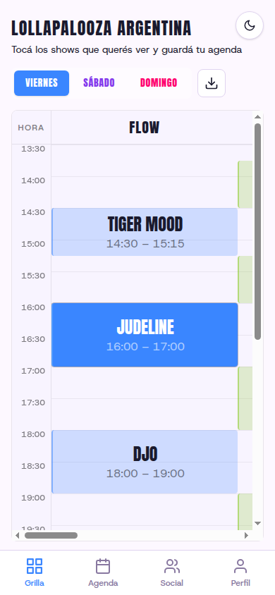
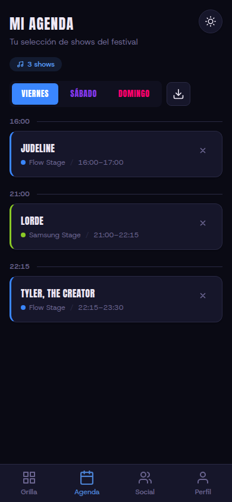
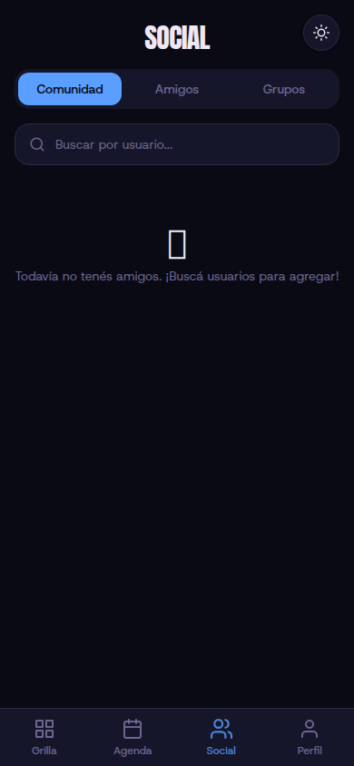

<div align="center">

# MiGrilla

**Arma tu agenda del festival y coordina con tus amigos.**

Una PWA mobile-first para que los asistentes a un festival puedan explorar la grilla de artistas, armar su agenda personal, y coordinar con amigos y grupos.

[](https://nextjs.org/)
[](https://react.dev/)
[](https://tailwindcss.com/)
[](https://supabase.com/)
[](https://www.typescriptlang.org/)
[](https://web.dev/progressive-web-apps/)

</div>

---

## Screenshots

<div align="center">
<table>
  <tr>
    <td align="center"><strong>Grilla (Dark)</strong></td>
    <td align="center"><strong>Grilla (Light)</strong></td>
    <td align="center"><strong>Mi Agenda</strong></td>
    <td align="center"><strong>Social</strong></td>
  </tr>
  <tr>
    <td></td>
    <td></td>
    <td></td>
    <td></td>
  </tr>
</table>
</div>

---

## Features

- **Grilla interactiva** — Vista de schedule por escenario y horario. Filtra por dia, toca shows para agregarlos a tu agenda.
- **Agenda personal** — Lista organizada de los shows que queres ver, con deteccion de conflictos de horario y exportacion como imagen (Canvas API).
- **Social** — Agrega amigos por username, crea grupos con codigo de invitacion, compara agendas y coordina en el festival.
- **Autenticacion flexible** — Username anonimo (sin email), Google OAuth, o email + password. Upgrade de cuenta sin perder datos.
- **Dark mode** — Tema claro y oscuro con transicion suave.
- **PWA** — Instalable en la pantalla de inicio, funciona offline con Service Worker (Serwist).
- **Exportar como imagen** — Genera una imagen de tu agenda o la grilla completa para compartir en redes (1080px, Canvas API nativa).

---

## Tech Stack

| Layer | Technology |
|-------|-----------|
| Framework | [Next.js 16](https://nextjs.org/) (App Router, Server Components, Server Actions) |
| UI | [React 19](https://react.dev/) (ViewTransitions, useActionState) |
| Styling | [Tailwind CSS 4](https://tailwindcss.com/) (`@theme` tokens, CSS-native dark mode) |
| Database | [Supabase](https://supabase.com/) (PostgreSQL + Row Level Security) |
| Auth | Supabase Auth (Anonymous, Google OAuth, Email/Password) |
| PWA | [Serwist](https://serwist.pages.dev/) (Service Worker, offline support, install prompt) |
| Language | TypeScript (strict mode) |
| Fonts | [Anton](https://fonts.google.com/specimen/Anton) (display) + [Host Grotesk](https://fonts.google.com/specimen/Host+Grotesk) (body) |

---

## Getting Started

### Prerequisites

- **Node.js** >= 20
- **pnpm** (recommended) or npm
- **Docker** (for local Supabase — optional)

### 1. Clone & install

```bash
git clone https://github.com/Joaquinvesapa/MiGrilla.git
cd MiGrilla
pnpm install
```

### 2. Environment variables

Create a `.env.local` file at the project root:

```env
NEXT_PUBLIC_SUPABASE_URL=your_supabase_url
NEXT_PUBLIC_SUPABASE_ANON_KEY=your_supabase_anon_key
SUPABASE_SERVICE_ROLE_KEY=your_service_role_key
NEXT_PUBLIC_SITE_URL=http://localhost:3000
```

> You can get these from your [Supabase dashboard](https://app.supabase.com/) or by running Supabase locally.

### 3. Database setup (local Supabase)

```bash
npx supabase start          # Starts local Supabase (requires Docker)
npx supabase db reset        # Applies all migrations
```

Migrations live in `supabase/migrations/`.

### 4. Run the dev server

```bash
pnpm dev
```

Open [http://localhost:3000](http://localhost:3000) — the app uses Turbopack for fast HMR.

---

## Scripts

| Command | Description |
|---------|-------------|
| `pnpm dev` | Start dev server with Turbopack |
| `pnpm build` | Production build (webpack + Service Worker) |
| `pnpm start` | Start production server |
| `npx tsc --noEmit` | Type-check without emitting |
| `npx supabase start` | Start local Supabase |
| `npx supabase db reset` | Reset DB with all migrations |
| `npx supabase migration new <name>` | Create a new migration |

---

## Project Structure

```
app/
  layout.tsx              # Root layout (fonts, metadata, PWA config)
  globals.css             # Tailwind 4 @theme tokens + dark mode
  login/                  # Auth (username+PIN, Google OAuth)
  onboarding/             # Profile setup for new OAuth users
  auth/callback/          # OAuth callback handler
  (app)/                  # Authenticated route group
    grilla/               # Festival schedule grid
    agenda/               # Personal agenda
    social/               # Community, friends, groups
    perfil/               # Profile settings
components/               # Shared UI components (all custom, no libraries)
lib/
  supabase/               # Supabase client factories (browser, server, admin)
  schedule-types.ts       # Schedule grid types
  schedule-utils.ts       # Parsing, time math, stage colors
  profile-types.ts        # Profile interfaces
  friendship-types.ts     # Friendship status enums
  group-types.ts          # Group/member types
  canvas-utils.ts         # Canvas API helpers for image export
middleware.ts             # Auth guard + onboarding redirect
supabase/migrations/      # Database migrations (PostgreSQL)
```

---

## Design Decisions

- **No UI libraries** — Every component is custom-built. No shadcn/ui, Radix, or Material UI.
- **`as const` enums** — TypeScript `enum` is never used. All enum-like values use `const` objects with `as const`.
- **Server/Client boundary** — Pages are async Server Components that fetch data; interactive parts are Client Components in `_components/` folders.
- **Colocated Server Actions** — Each route has its own `actions.ts` with `"use server"` directive.
- **CSS tokens over config** — Colors and fonts are defined as CSS custom properties in `@theme` blocks (Tailwind CSS 4), not in a `tailwind.config` file.
- **Accessibility first** — `aria-label`, `aria-pressed`, `aria-current` on all interactive elements. Skip-to-content link in root layout.
- **Spanish UI** — All user-facing text is in Rioplatense Spanish.

---

## License

This project is open source and available under the [MIT License](LICENSE).

---

<div align="center">

Hecho con :purple_heart: por [JoaquinVesapa](https://github.com/Joaquinvesapa)

</div>
